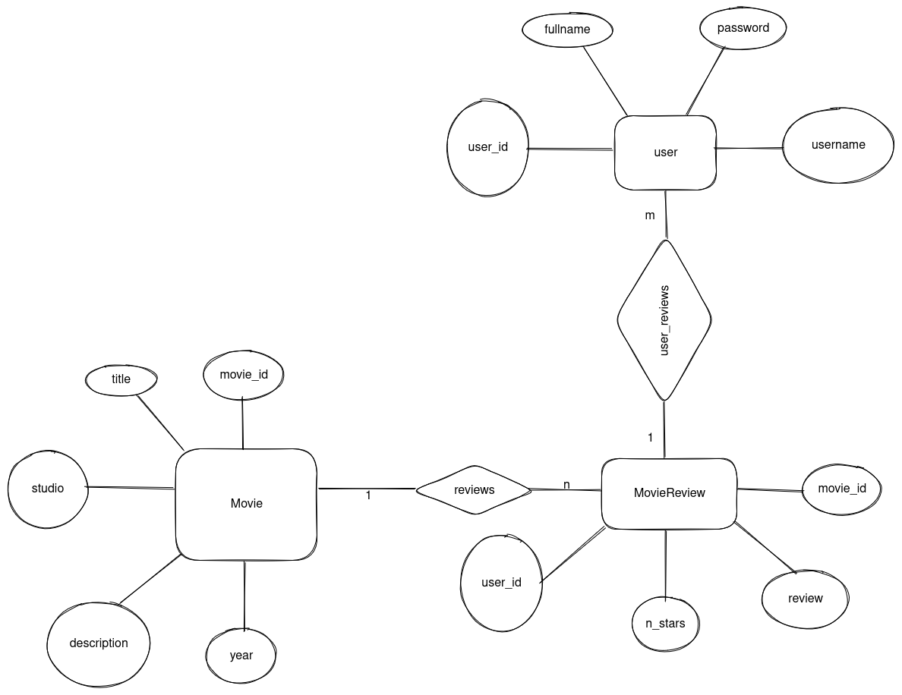
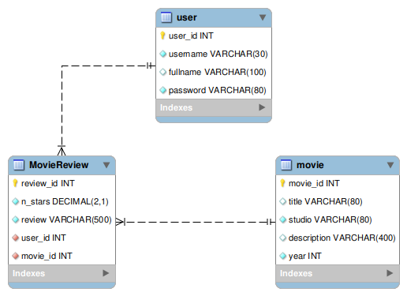

# MySQL Movie REST API

# To run the server localy:
1. Clone the repository:
```sh
git clone https://github.com/RicardoRibeiroRodrigues/MoviesAPI/
```
2. Install dependencies:
```sh
pip install -r requirements.txt
```
3. Place the necessary credentials in a .env file:
```sh
export MD_DB_SERVER="{YOUR_MYSQL_SERVER}"
export MD_DB_USERNAME="{YOUR_USERNAME}"
export MD_DB_PASSWORD="{YOUR_PASSWORD}"
```
4. Create the database in MYSQL WORKBENCH or using the script we provided.
```sh
python create_or_reset_db.py
```
5. Run the server with:
```sh
uvicorn main:app --reload
```

# ER Diagram:



# Database Diagram:



# Project Video:

[](https://youtu.be/_TvoIRiWiOU "API Demonstration")

# Project Video Part 2:

[](https://www.youtube.com/watch?v=y4ZxlYrwkDI "API Demonstration with ORM")

# Students:
- [Guilherme Fontana Louro](https://github.com/guifl2001)
- [Ricardo Ribeiro Rodrigues](https://github.com/RicardoRibeiroRodrigues)
